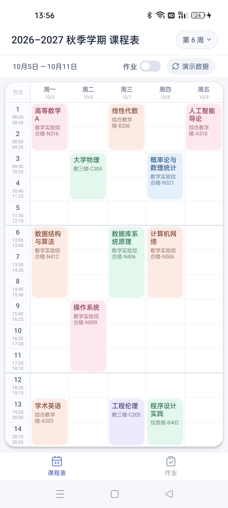
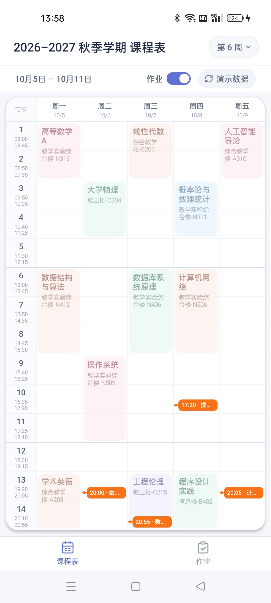
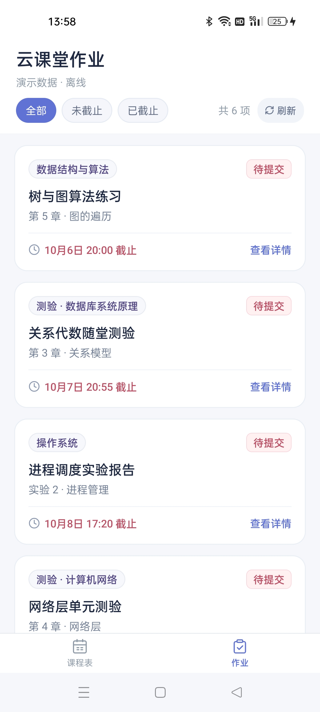
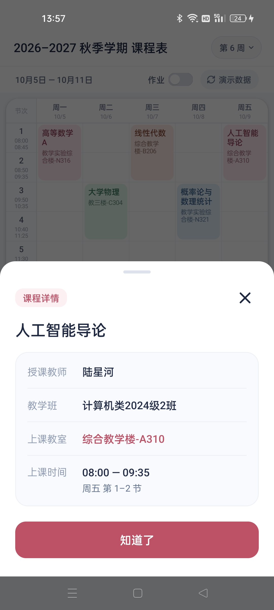
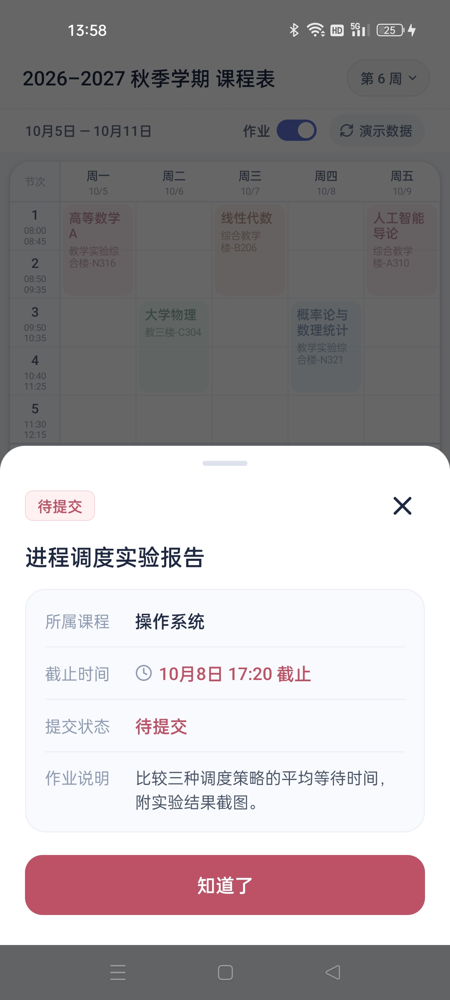
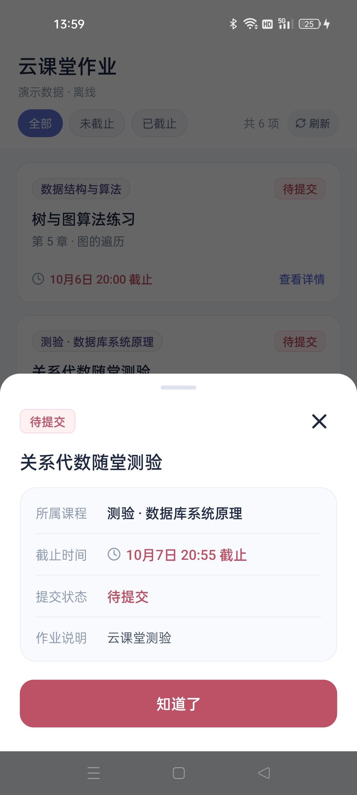
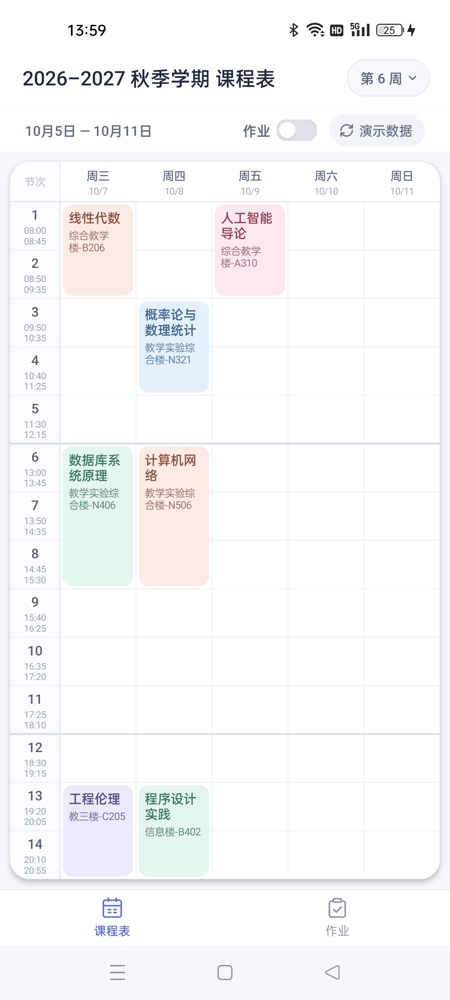

# 北邮课表 · BUPT Class Schedule

**这一周上什么课，哪天交作业，一张课表就能看。**

面向北京邮电大学学生的原生 Android 应用。从教务系统获取课表，从云课堂读取作业和测验，再把截止时间放进每周的课程时间轴。查教室、看课程详情、确认待交任务，都可以在手机上完成。

支持 Android 6.0 及以上。本项目为个人开发的非官方应用。

## 下载与安装

[下载 v1.0.2 正式版 APK](https://github.com/ofyc-666/bupt-class-schedule/releases/download/v1.0.2/BUPT-Class-Schedule-v1.0.2.apk) · [查看版本记录](https://github.com/ofyc-666/bupt-class-schedule/releases)

下载 APK 后在 Android 手机上安装。已有正式版可以直接更新安装，保留本机账号和缓存。

## 界面预览

<table>
  <tr>
    <th>一周课程</th>
    <th>课表上的作业截止时间</th>
    <th>作业与测验列表</th>
  </tr>
  <tr>
    <td></td>
    <td></td>
    <td></td>
  </tr>
</table>

## 主要功能

### 按周看课表，点开看详情

登录后自动定位当前教学周，也可以点击右上角的周次查看其他周。课程按当天的节次排列，覆盖上午、下午和晚间；每个课程块直接显示课程名称和教室。课表支持横向滑动，周六、周日也可以查看。

点击课程块即可查看授课教师、教学班、上课教室，以及具体时间和节次。

### 把截止时间放到课表上

开启课表上方的「作业」开关后，本周尚未完成的作业和测验会按截止日期与时间显示在课表中。课程块会淡化，让任务标记更醒目；点击标记即可查看任务详情。

开关控制的是任务显示。已有任务缓存时，开关可以直接使用；需要更新任务时，进入作业页即可同步。

### 集中查看作业与测验

作业页仅显示云课堂中未提交的普通作业和测验，显示所属课程、任务标题、章节和截止时间。测验带有「测验」标识，可以按「全部」「未截止」「已截止」筛选，也可以点击刷新按钮重新同步。

任务详情展示提交状态、截止时间和可读取的作业说明。

<table>
  <tr>
    <th>课程详情</th>
    <th>普通作业详情</th>
    <th>测验详情</th>
  </tr>
  <tr>
    <td></td>
    <td></td>
    <td></td>
  </tr>
</table>

<details>
<summary>查看横向滑动后的周末课表</summary>

<p>横向滑动课表即可查看这一周后面的日期，包括周六和周日。</p>


</details>

## 开始使用

1. **登录教务。** 填写学号和教务密码，获取当前学期课表。云邮密码可以先留空，课表功能仍可正常使用。
2. **按需配置云邮。** 可以在首次登录时填写云邮密码，也可以之后点击作业页或课表上的「作业」开关，按提示完成配置。验证成功后会自动同步一次任务。
3. **查看并更新任务。** 首次从课表开关配置云邮后，开关会保持关闭；再次开启即可显示同步到的任务。以后进入作业页或点击该页的刷新按钮，就能更新作业和测验。

教务密码与云邮密码分别用于对应系统，请填写各自的密码。云邮配置失败时，已经获取的课表仍可继续使用，之后可在作业页重新配置。

### 什么时候会同步？

| 操作或场景 | 行为 |
| --- | --- |
| 打开课表 | 优先显示本地缓存；当天还没有成功更新时，在应用打开或回到课表前台时尝试更新课表 |
| 点击课表刷新 | 立即尝试更新课表 |
| 首次登录时填写云邮密码，或之后完成云邮配置 | 云邮验证成功后自动同步一次作业和测验 |
| 从课表进入作业页 | 先显示已缓存任务，再自动同步；停留在作业页时可点击刷新 |
| 已配置云邮后开关课表上的作业显示 | 显示或隐藏已有任务，不触发同步 |

课表和任务保存在本地，已经成功同步过的内容可以离线查看。同步失败时会保留已有缓存；部分课程读取失败时也会保留相应的旧任务。

## 账号与数据

应用由手机直接访问学校教务系统和 UCloud，无需部署配套服务器。学号、教务密码和云邮密码加密保存在本机，使用 Android Keystore 管理密钥，通过 AES-GCM 保存密文。

作业页支持重新验证云邮密码，也可以单独清除云邮密码，保留教务账号和课表。任务提交与测验作答仍需在学校云课堂完成；App 当前不提供后台定时同步或系统通知提醒。同步结果受学校接口、网络状况和课程开放情况影响，请以教务系统和云课堂为准。

## 构建与测试

使用 JDK 17，并安装 Android SDK 35 和 Build Tools 36.0.0。配置本机 Android SDK 路径后，在项目根目录运行：

```powershell
.\gradlew.bat testDebugUnitTest lintDebug
.\gradlew.bat assembleDebug
```

Debug APK 输出位于 `app/build/outputs/apk/debug/`。发布构建可运行 `assembleRelease`，生成的 APK 需要使用自己的签名密钥签名后安装。

<details>
<summary>可选：服务器自动提醒参考实现</summary>

`server-reference/` 提供 UCloud 任务检测、快照差异、提醒策略与可选 PushPlus 的核心代码，供有自动通知需求的二次开发者使用。Android App 独立运行，不依赖这部分代码。

参考实现需要自行接入存储、定时调度与用户配置，适用于 VPS、NAS 或其他 Node.js 环境；详见 [服务器参考实现说明](server-reference/README.md)。

</details>

## 致谢与许可证

北邮移动教务实现参考并适配自 [Nemoyuzx/where_to_study](https://github.com/Nemoyuzx/where_to_study)，详见 [第三方声明](THIRD_PARTY_NOTICES.md)。本仓库代码按 [GPL-3.0](LICENSE) 授权。
